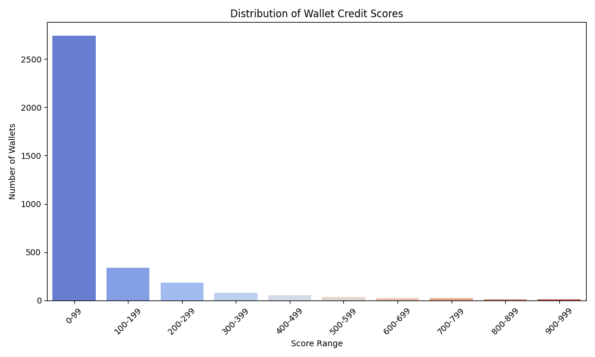

# Analysis of Given wallets
## Score Distribution

## Summary
- Total wallets analyzed: 3497
- Number of wallets with perfect credit score (1000): 0

- Number of wallets with zero credit score (0):943

## Top 3 Wallets by Credit Score
| Wallet | Credit Score | Net Borrow USD | Net Deposit USD | Asset Diversity | Liquidations |
|--------|--------------|----------------|-----------------|-----------------|--------------|
| 0x02eca8cc78b7d30c1ac5e16988ed2c8a9da658d6 | 1000.0000000000001 | 19204088.83 | 7638950.74 | 8.00 | 0 |
| 0x058b10cbe1872ad139b00326686ee8ccef274c58 | 993.365669818278 | 26096946.47 | 21463870.35 | 7.00 | 0 |
| 0x000f7f22bfc28d940d4b68e13213ab17cf107790 | 984.4932545599239 | 132312.52 | 224573.59 | 5.00 | 0 |

## Bottom 3 Wallets by Credit Score
| Wallet | Credit Score | Total USD | Net Borrow USD | Net Deposit USD | Asset Diversity | Liquidations |
|--------|---------------|-----------|----------------|-----------------|-----------------|--------------|
| 0x0185e80948461135faabd6d01fe4afa8586fe6c4 | 0.0 | 1.86 | 0.00 | 1.86 | 1.00 | 0 |
| 0x01b700a7f8797609c8e86b21d3e5a765d608b9a2 | 0.0 | 1.13 | 0.00 | 1.13 | 1.00 | 0 |
| 0x04008507db2ab8b2bf5410905d4b146ea8009c2f | 0.0 | 1.12 | 0.00 | 1.12 | 1.00 | 0 |

