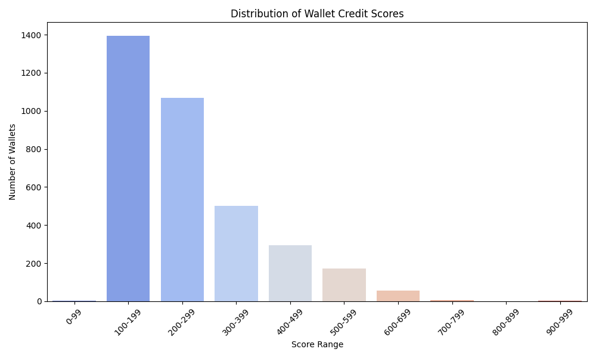

# Analysis of Given wallets
## Score Distribution

## Summary
- Total wallets analyzed: 3497
Number of wallets with perfect credit score (1000): 1

Number of wallets with zero credit score (0):1

## Top 3 Wallets by Credit Score
| Wallet | Credit Score | Net Borrow USD | Net Deposit USD | Asset Diversity | Liquidations |
|--------|--------------|----------------|-----------------|-----------------|--------------|
| 0x02eca8cc78b7d30c1ac5e16988ed2c8a9da658d6 | 1000.0 | 19204088.83 | 7638950.74 | 8.00 | 0 |
| 0x058b10cbe1872ad139b00326686ee8ccef274c58 | 897.151075559658 | 26096946.47 | 21463870.35 | 7.00 | 0 |
| 0x000f7f22bfc28d940d4b68e13213ab17cf107790 | 758.3595402105107 | 132312.52 | 224573.59 | 5.00 | 0 |

## Bottom 3 Wallets by Credit Score
| Wallet | Credit Score | Total USD | Net Borrow USD | Net Deposit USD | Asset Diversity | Liquidations |
|--------|---------------|-----------|----------------|-----------------|-----------------|--------------|
| 0x02a16f8df2b11b3a0c9f47cc5d705830792e3e6f | 0.0 | 11207.81 | 997.68 | 981.94 | 5.00 | 26 |
| 0x04426a58fdd02eb166b7c1a84ef390c4987ae1e0 | 86.4922095364572 | 43630.70 | 7605.70 | 5127.45 | 6.00 | 17 |
| 0x02eb2ee0867dc3dfaa3862d0cc86984b6aada907 | 164.83030647667815 | 10925.36 | 2393.92 | 3146.80 | 4.00 | 10 |

