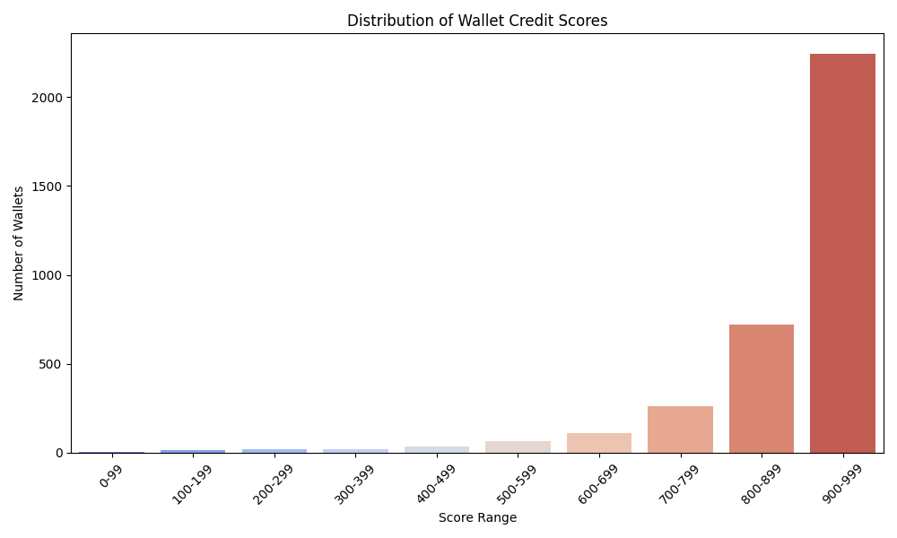

# Wallet Credit Score Analysis

## Score Distribution

## Summary
- Total wallets analyzed: 3497- Wallets with score <= 200: 19 - Wallets with score >= 800: 2963
## Wallet Behavior by Score Range
The table below summarizes average wallet behavior across credit score ranges:

| Score Range | Total USD | Net Borrow USD | Net Deposit USD | Asset Diversity | Liquidations |
|-------------|-----------|----------------|-----------------|-----------------|--------------|
| (0, 200] | 58374373.00526854 | 3312975.5794588076 | 555772.4802010065 | 5.0 | 0.16666666666666666 |
| (200, 400] | 10933661.624441229 | 266892.70520302147 | -780027.1163028599 | 5.340909090909091 | 0.1590909090909091 |
| (400, 600] | 1683574.7842971487 | 55773.886762983035 | -183815.29718772526 | 5.505050505050505 | 1.1717171717171717 |
| (600, 800] | 273825.5106430196 | 8369.811894339828 | -7095.502969236216 | 4.830645161290323 | 0.3064516129032258 |
| (800, 1000] | 11436.748552045612 | 342.42763684753976 | -46.80750515445512 | 1.958150523118461 | 0.0026999662504218697 |
